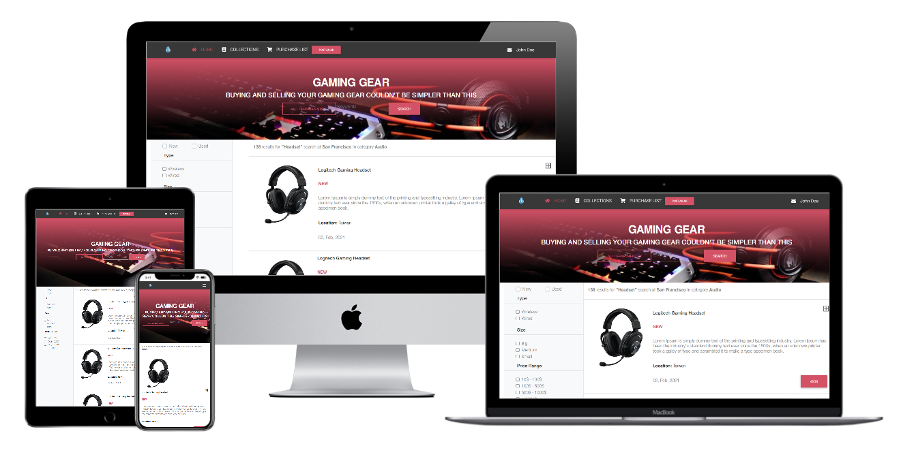

# Project Name: Gaming Gear E-Shop

## HTML/CSS Capstone project

Beaufitul responsive Gaming Gear E-Shop built with the design idea of [Mohammed Awad](https://www.behance.net/M_Awad)

Skills Revived & Learned:

- Versioning & best coding practices, Github Flow.
- HTML5, CSS3 elements, semantics, features etc.
- Linter - install & fix errors
- HTML5, CSS3, Bootstrap, JavaScript.
- Position, Flex, Grid, Floats, RWD

## Screenshots

- Main View

- Results view

## Built With

- Major languages: HTML5, CSS, JavaScript
- Frameworks: Bootstrap, MDBootstrap

## Live Demo

[Live Demo Link](https://notrexxx.github.io/HTML-CSS-CAPSTONE/)

## Getting Started

- Run this command in your OS terminal: `git clone https://github.com/notrexxx/HTML-CSS-CAPSTONE.git` to get a copy of the project.
- To run the project open the `index.html` file in a web browser.

### Prerequisites

* Internet connection
* A browser that supports HTML5

### Setup

* Clone the repository

### Usage

* Open index.html in your browser

### Deployment

To deploy on to github pages first push the project to a repository, then
in the project settings there is a section called github pages that will let you choose the branch that you want to deploy, after the branch is selected the project will be live on your-github-username.github.io/your-github-repo-name

## Author

👤 **Andres Leon**

- GitHub: [@notrexxx](https://github.com/notrexxx)
- Twitter: [@emigdioleon1](https://twitter.com/emigdioleon1)
- LinkedIn: [Emigdio Leon](https://linkedin.com/emigdio-leon-689109195)

## Show your support

Give a ⭐️ if you like this project!

## Acknowledgments

- [Mohammed Awad on Behance](https://www.behance.net/M_Awad)
- Stand Up Team
- W3Schools.com

## 📝 License

This project is [MIT](./LICENSE) licensed.
